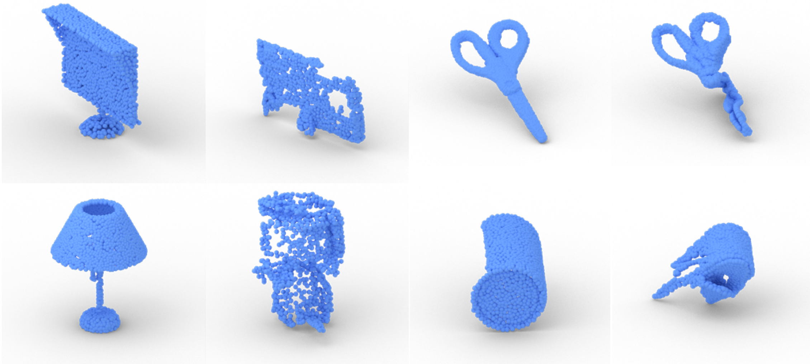

# ImplicitPCDA
We provide our PyTorch implementation of our paper ['Domain Adaptation on Point Clouds via Geometry-Aware Implicits'](https://arxiv.org/pdf/2112.09343.pdf) (IEEE CVPR 2022). By using geometry-awrae implicits representation, our method can align point clouds from different domains in feature space well.

Here we show point clouds from different domains in an image.

We will release our code soon! If you have any questions, please feel free to contact me!