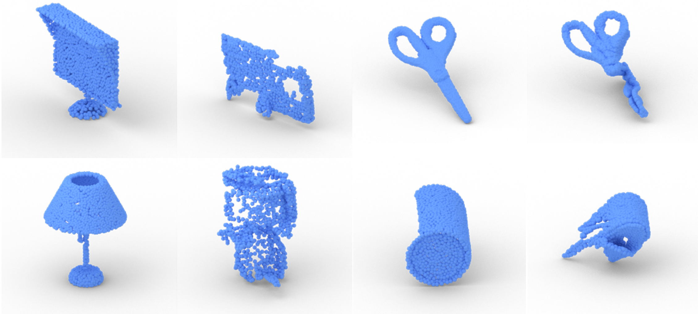
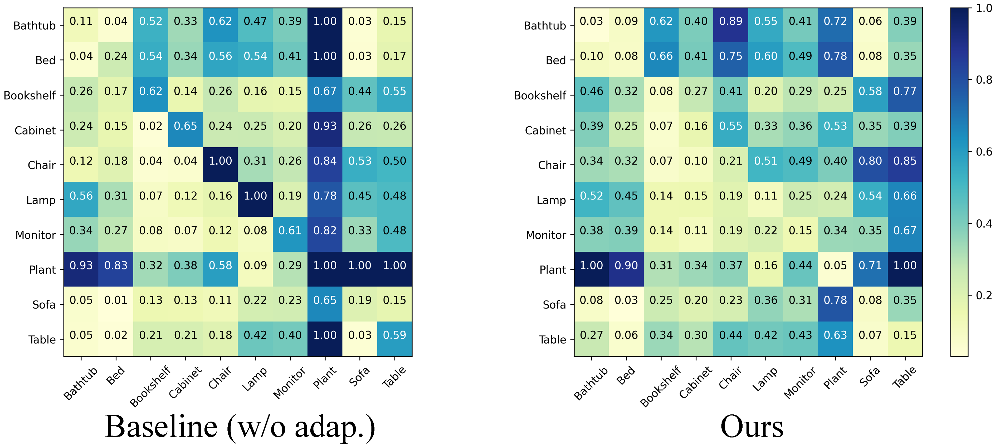

# ImplicitPCDA
We provide our PyTorch implementation of our paper ['Domain Adaptation on Point Clouds via Geometry-Aware Implicits'](https://arxiv.org/pdf/2112.09343.pdf) (IEEE CVPR 2022). By using geometry-awrae implicits representation, our method can align point clouds from different domains in feature space well.

Here we show point clouds from different domains in an image.



## Domain Alignment
Class-wise MMD for the task: ModelNet to ScanNet in PointDA-10 dataset. Diagonal shows source-target distances of the same class. Upper and lower triangular matrices indicate distances between different classes in the source and target domain, respectively. Our method maintains class-wise distances well.



We will release our code soon! If you have any questions, please feel free to contact me!

### Dataset Preprocessing
For generating point clouds from [GraspNet](https://graspnet.net/), we need to render depth maps firstly. Refer to my repo [ObjsDepthRender](https://github.com/Jhonve/ObjsDepthRender) for more information.

### GraspNetPC-10
From [Google Drive Link](https://drive.google.com/file/d/1VVHmsSToFMVccge-LsYJW67IS94rNxWR/view?usp=sharing).

### Citation
If you find this useful for your research, please cite the following paper.

```latex
@InProceedings{Shen_2022_CVPR,
    author    = {Shen, Yuefan and Yang, Yanchao and Yan, Mi and Wang, He and Zheng, Youyi and Guibas, Leonidas J.},
    title     = {Domain Adaptation on Point Clouds via Geometry-Aware Implicits},
    booktitle = {Proceedings of the IEEE/CVF Conference on Computer Vision and Pattern Recognition (CVPR)},
    month     = {June},
    year      = {2022},
    pages     = {7223-7232}
}
```

*Waiting for updating...*